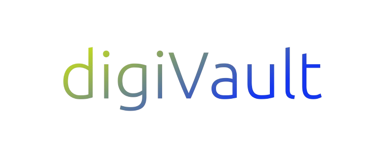

# digiVault 🔐

A decentralized digital vault built on the Internet Computer using **Motoko** and **React**. digiVault allows users to securely store, retrieve, and manage digital notes and assets on-chain with full privacy and transparency.



## Features

- Fully decentralized storage on Internet Computer
- Motoko-powered backend with persistent data
- React frontend with sleek UI
- Secure note creation & deletion
- Environment-based configuration with `.env`

---

## Tech Stack

- [Motoko](https://internetcomputer.org/docs/current/developer-docs/backend/motoko/)
- [React.js](https://reactjs.org/)
- [Vite](https://vitejs.dev/)
- Internet Computer (DFX CLI)

---

## ⚙️ Local Setup

1. **Clone the repo**
   ```bash
   git clone https://github.com/priya-gurung/digiVault.git
   cd digiVault

   Install dependencies

2. **Install dependencies**
   ```bash
   npm install
   
3. **Run local Internet Computer replica**
   ```bash
   dfx start --background

4. **Deploy the canisters**
   ```bash
   dfx deploy

5. **Start the frontend**
   ```bash
   npm start

